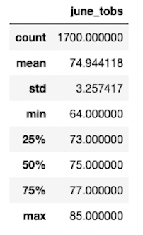
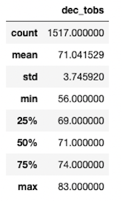
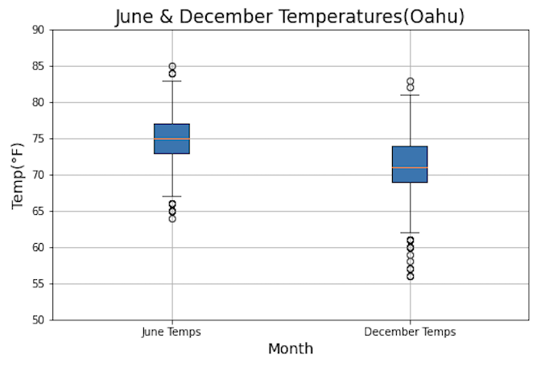
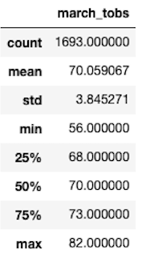
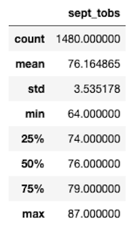

# Cowabunga Dude

## Overview
Wanting to open a shake and surf shop, I have already peformed an analysis on the precipitation and temperature data from the Hawaiian island of Oahu to present a business proposal to W. Avy who may want to invest in my new business venture. However, this analysis is only for the period starting August 23, 2016 and ending August 23, 2017. Since W. Avy wants more information about the temperature trends on Oahu to make his decision, I will perform an analysis on all the temperature data for the months of June and December to determine the year-round viability of the shake and surf shop.

---
## Results
My analysis of the temperature data for the month of June revealed the following statistcal summary:

Meanwhile, the following summary is for the temperature data for the month of December:

---
## Differences
* The first statistic that jumps out at me is that, while both the months of June and December have a good number of observations, June has 1700 observations, which is almost 200 more than the 1517 observations there are for December. The greater number of observations for June give a clearer picture about the variability of the temperature data in June.

* Speaking of variability, the standard deviation for the June temperature data is 3.257 and is 3.746 for the December temperature data. While the difference in the standard deviation may not seem so large, this data combined with the higher number of observation for June data shows that the temperatures in December vary more than the temperatures in June.

* As one would expect, the temperature ranges for the month of June are higher than December. The maximum temperature for June is 85 degrees while the maximum temperature for December is 2 degrees lower at 83 degrees. The minimum temperature for June is 64 degrees while the minimum temperature for December is 8 degrees lower at 56 degrees.

---
## Summary
In the end, both the June temperature data and the December temperature data are pretty symmetrical since their mean and medians are very close to each other. For June, the mean temperature is 74.94 °F and the median temperature is 75 °F; for December, the mean temperature is 71.04 °F and the median temperature is 71 °F. However, the December data is more spread out, which can be seen in the higher standard deviation and the bigger range of temperatures during the month of December. The June data may be more reliable for the preparations needed for the new shake and surf shop. Also, the higher temperature ranges for June when compared to December mean that it may be wise to carry more hot drink and food options in December and more cold options in June.  

---
### Temperature Box Plot
Additionally, an analysis of the outliers for both the June and December temperatures may be useful to get the full picture of the temperature data. A good way to get a snapshot of the outliers would be with a box plot:

The box plot provides a nice visualization of the temperatures. As was evident in the summary data, the box plot shows that December has a lot more outliers than the month of June, especially at the lower end temperatures. It's clear that the December temperatures are less reliable and it would be advisable to plan for the changes in weather.

---
### Analysis of March and September Temperatures
Lastly, getting the temperature data for the months of March and September would be extremely helpful to determine if the shop is viable year round, as it would provide a snapshot of the temperature in three-month intervals when combined with the data from June and December. The month of March had the following statistical summary:

The temperatures in March are very similar to the temperatures for December. The mean and median temperatures in March are 70.06 °F and 70 °F, respectively; meanwhile, the standard deviation is 3.845. The March temperatures seem to have almost same amount of variance as the December temperatures.

The September temperatures more closely resemble the June temperatures:

The mean for the September temperatures is 76.16 °F, the median is 76 °F and the standard deviation is 3.535. The range of temperatures for September are also similar to the temperatures from June with a maximum temperature of 87 °F and a minimum temperature of 64 °F. Taking all this data into account, having two slightly different menus for the months of June to September and for the months of December to March would increase the long-term viability of the shake and surf shop. 

